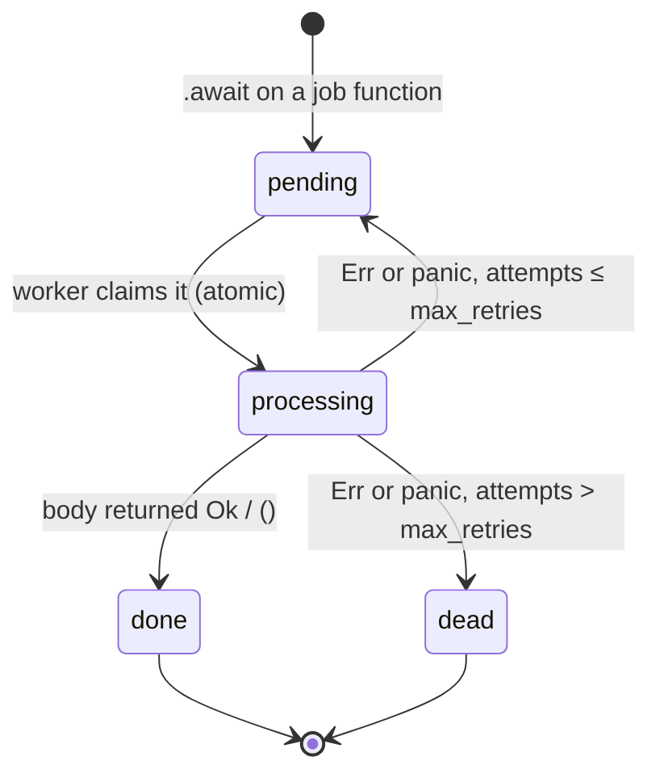

# butler

A small Sidekiq-style background job runner for Rust. Put `#[butler::job]` on an
async function, and calling it with `.await` no longer runs the body. Instead it
queues a job, and a worker process runs the body later.

```rust
#[butler::job]
async fn send_email(to: String, subject: String) -> Result<(), MailError> {
    smtp::send(&to, &subject).await   // runs later, in the worker
}

// In your app: this puts the job on the queue and returns right away.
let job_id = send_email("ada@example.com".into(), "Welcome".into()).await?;
```

This is an MVP: the queue is either a directory of JSON files or Redis, and the
worker runs on tokio or on plain threads.

## Two kinds of `.await`

In the injector's loop, these two lines look the same and mean different
things:

```rust
tokio::time::sleep(Duration::from_millis(200)).await;          // (1) async/await
let id = demo::process_tick(tick, now_ms(), pid).await?;       // (2) enqueue a job
```

1. **Regular async/await.** The future runs right here, in this process, on the
   tokio runtime. The line finishes once the 200ms have passed.
2. **Enqueuing a butler job.** The future serializes the arguments, writes a
   job to the queue and finishes within a millisecond. The function body
   does not run here. A worker process picks up the job and runs it,
   possibly on another machine and possibly much later.

### How Rust tells them apart

It doesn't. For Rust, `.await` always means the same thing: poll this future
until it is ready. `.await` never talks to tokio directly. It only polls the
future in front of it. What happens depends entirely on which function you
called, and that is fixed at compile time.

The `#[butler::job]` macro rewrites the function you wrote. Given

```rust
#[butler::job]
async fn send_email(to: String) -> Result<(), MailError> { smtp::send(&to).await }
```

the compiler sees roughly:

```rust
// 1. What callers get: a function whose only job is to enqueue.
async fn send_email(to: String) -> Result<JobId, butler::Error> {
    let args = vec![serde_json::to_value(&to)?];
    butler::__private::enqueue("send_email", args).await   // write to the queue
}

// 2. Your original body, under a hidden name. Only the worker calls it.
async fn __butler_perform_send_email(to: String) -> Result<(), MailError> {
    smtp::send(&to).await
}

// 3. A function that decodes the JSON args and calls (2).
fn __butler_dispatch_send_email(args: Vec<Value>) -> BoxFuture { /* ... */ }

// 4. A registration entry: "send_email" -> (3), so a worker can find it by name.
mod send_email { pub const JOB: butler::JobDef = /* ... */; }
inventory::submit! { send_email::JOB }
```

So `send_email(...).await` in your app resolves to (1). The worker never calls
`send_email`. It reads `"name": "send_email"` from the queued job, looks up that
name, and runs (3), which runs your original body (2).

The return type also shows the difference. The enqueue returns
`Result<JobId, butler::Error>`, not your function's `Result<(), MailError>`, so
code that expects the job's result won't compile. You can't accidentally treat
a queued job as work that has already run.

```mermaid
sequenceDiagram
    autonumber
    participant App as Injector<br/>(tokio runtime)
    participant Q as Queue backend<br/>(files or Redis)
    participant W as Worker<br/>(tokio runtime)

    Note over App: tokio::time::sleep(200ms).await
    App->>App: poll the timer future in this process
    Note over App: resumes 200ms later

    Note over App: send_email(to).await
    App->>Q: push {"name":"send_email","args":[...]}
    Q-->>App: JobId, within a millisecond
    Note over App: moves on; the body has not run

    loop every poll_interval
        W->>Q: claim(): take the oldest pending job, atomically
    end
    Q-->>W: Job {name, args}
    W->>W: look up "send_email", decode args,<br/>tokio::spawn(original body)
    Note over W: the body's own .awaits (smtp, sleep, ...)<br/>are regular tokio awaits here
    W->>Q: complete(job), or fail(job) to retry or mark dead
```

Inside the worker, the job body is ordinary async code. Its `.await`s are
regular tokio awaits, like (1) above. If the body calls another
`#[butler::job]` function, that call enqueues a new job, as in Sidekiq.

## Architecture

```mermaid
flowchart LR
    subgraph injector["injector process"]
        direction TB
        rt1["tokio runtime"]
        call["send_email(to).await"]
        rt1 --- call
    end

    subgraph backend["queue backend (from config.toml)"]
        direction TB
        file[("file<br/>.butler/pending/*.json")]
        redis[("redis<br/>LIST butler:pending")]
    end

    subgraph worker["worker process"]
        direction TB
        rt2["tokio runtime"]
        reg["job registry<br/>name → handler"]
        task1["tokio task: job A"]
        task2["tokio task: job B"]
        rt2 --- reg
        reg --> task1
        reg --> task2
    end

    call -- "push (spawn_blocking)" --> backend
    backend -- "claim (atomic)" --> worker
    worker -- "complete / fail" --> backend
```

Each job moves through these states:



## Running the demo

`examples/demo/` has two binaries that share one job (`demo::process_tick`). The
injector enqueues a job every second from a tokio main loop. The worker runs
the jobs in its own tokio main loop, up to 4 at a time. Each job sleeps
1.5s on the tokio timer, and every 7th job fails on purpose so you can see a
retry and then a dead job.

```sh
# Redis backend (what config.toml selects):
docker run -d --rm --name butler-redis -p 6379:6379 redis:8-alpine

cargo run -p demo --bin worker      # terminal 1
cargo run -p demo --bin injector    # terminal 2

# The same, on the file backend with no Redis:
BUTLER_QUEUE__BACKEND=file cargo run -p demo --bin worker
BUTLER_QUEUE__BACKEND=file cargo run -p demo --bin injector
```

Run both from the repository root, so they read the same `config.toml`. Press
Ctrl-C in the worker to stop it. It stops taking jobs and waits for the ones
already running to finish.

## Usage

### Defining jobs

```rust
#[butler::job]
pub async fn resize_image(path: String, width: u32) -> Result<(), ImageError> { ... }

#[butler::job(name = "billing.charge")]      // stable name, survives renames
pub async fn charge(customer_id: u64, cents: i64) { ... }
```

- Arguments must be owned values that serde can serialize (`String`, not
  `&str`). They are stored as JSON.
- The function may return `()`, `anyhow::Result<T>`, or `Result<T, E>` for any
  error type `E` that converts into `anyhow::Error`. An `Err` or a panic counts
  as a failure and triggers a retry. The error's full context chain
  (`format!("{e:#}")`) is saved as the job's `last_error`.
- The body must be `Send`, because the tokio worker runs each job as its own
  `tokio::spawn` task.

### Running a worker

```rust
#[tokio::main]
async fn main() -> Result<(), Box<dyn std::error::Error>> {
    let config = butler::Config::load()?;
    butler::Worker::from_config(&config)?
        .register(my_jobs::resize_image::JOB)   // see note below
        .run_async(async { let _ = tokio::signal::ctrl_c().await; })
        .await;
    Ok(())
}
```

A worker finds `#[job]` functions compiled into its own crate automatically.
Jobs defined in a separate library crate must be registered with
`.register(lib::job_name::JOB)`. If the worker binary never references
anything from that crate, the linker leaves the crate's code out, including
its automatic registration.

Without tokio, `Worker::run()` runs jobs on plain threads using butler's own
`block_on`. Job bodies then can't use tokio timers or I/O.

In tests, `worker.drain()` runs everything queued, including retries, and
returns, like Sidekiq's `drain_all`.

## Configuration

`butler::Config::load()` reads `./config.toml`, or the file named by
`$BUTLER_CONFIG`. Every key is optional.

```toml
[queue]
backend = "redis"            # "file" (default) or "redis"

[queue.file]
dir = ".butler"

[queue.redis]
url = "redis://127.0.0.1:6379/"
prefix = "butler"            # key namespace

[worker]
concurrency = 4              # jobs running at once
max_retries = 3
poll_interval_ms = 100
```

Environment variables override any key, with `__` between levels:
`BUTLER_QUEUE__BACKEND=file`, `BUTLER_QUEUE__REDIS__URL=redis://host:6379/`,
`BUTLER_WORKER__CONCURRENCY=8`.

## Cargo features

| Feature | Default | Adds |
|---|---|---|
| `tokio` | yes | `Worker::run_async`; inside a tokio runtime, enqueue file and network I/O runs on tokio's blocking thread pool |
| `redis` | yes | `RedisQueue` and `backend = "redis"` |

To build without Redis, for example to use only the file backend:

```toml
butler = { path = "...", default-features = false, features = ["tokio"] }
```

If `config.toml` selects `redis` in a build without the feature,
`Config::connect()` returns an error saying so.

## Backends

Both backends implement `butler::Backend` (`push`, `claim`, `complete`,
`fail`, `get`). The worker and the enqueue path only use that trait.

**File** (`crates/butler/src/backend/file.rs`). One JSON file per job, under
`pending/ processing/ done/ dead/`. Each write goes to `tmp/` first and is then
renamed into place, so a worker never reads a half-written file. A claim is a
`rename` from `pending/` to `processing/`, which is atomic. When several
workers race for a job, exactly one rename succeeds.

**Redis** (`crates/butler/src/backend/redis.rs`). Uses lists, the same layout idea as Sidekiq:

| Key | Type | Purpose |
|---|---|---|
| `butler:pending` | LIST | job ids; `LPUSH` to enqueue, taken from the right (FIFO) |
| `butler:processing` | LIST | ids claimed by a worker |
| `butler:dead` | LIST | ids that exhausted their retries |
| `butler:job:<id>` | HASH | `state` and `data` (job JSON); expires 24h after success |

A claim is a single `LMOVE pending processing`, which Redis runs atomically,
so only one worker gets each job. It doesn't use Redis `PUBLISH`/`SUBSCRIBE`,
for two reasons. Pub/sub sends each message to every subscriber, so each job
would run once per worker. And it drops messages sent while no worker is
connected. A list keeps each job until exactly one worker takes it.

## Limitations

- **Crashed workers.** If a worker dies mid-job, the job stays in
  `processing` forever. A reaper that requeues old `processing` entries is the
  next step (Sidekiq Pro's "super fetch").
- **Retries.** Failed jobs are retried right away, with no delay between
  attempts. There are no scheduled jobs (`perform_in`) and no named queues or
  priorities.
- **Polling.** Workers check for jobs every `poll_interval_ms`. Redis could
  wake them as soon as a job arrives instead (`BLMOVE`).
- **One Redis connection per process.** All Redis calls share one connection
  behind a lock. A connection pool would be the upgrade.
- **Job names are the contract.** Renaming a function strands jobs already
  queued under the old name. Use `#[job(name = "...")]` for names that need to
  stay stable.

## Layout

```text
Cargo.toml                       workspace: shared metadata, lints, dependency versions
crates/butler/                   the library (published as `butler`)
  src/lib.rs                     public API, global queue, enqueue helper
  src/job.rs                     Job, JobId, JobState
  src/backend/mod.rs             Backend trait, Queue handle
  src/backend/file.rs            file backend
  src/backend/redis.rs           Redis backend (feature "redis")
  src/config.rs                  config.toml loading
  src/worker.rs                  Worker: run (threads), run_async (tokio), drain
  src/executor.rs                minimal block_on for runtime-free use
  tests/                         end-to-end tests (file, tokio, redis, retries)
  examples/no_tokio.rs           the same flow without tokio
crates/butler-macros/            #[job] attribute macro (published as `butler-macros`)
examples/demo/                   injector + worker binaries (not published)
justfile                 format, lint, test, audit and demo tasks
deny.toml, taplo.toml    dependency policy, TOML formatting
```

## Development

The toolchain is pinned in `rust-toolchain.toml` (and `mise.toml`). Common
tasks are in the `justfile`:

```sh
just format        # cargo fmt + taplo fmt
just ci            # format check, clippy on every feature combination, tests
just audit-deps    # cargo deny: advisories, bans, sources
just redis         # throwaway Redis for the demo and the Redis test
just worker        # demo worker
just injector      # demo injector
just publish-dry-run  # package and verify both crates as crates.io would
```

Workspace lints deny `unsafe_code`, `unused_qualifications`, `unwrap_used` and
`expect_used`; tests opt out with a file-level `#![allow(...)]`. The Redis test
needs a server at `$BUTLER_TEST_REDIS_URL` or `redis://127.0.0.1:6379/`, and is
skipped when none is reachable. Code conventions are in `AGENTS.md`.
