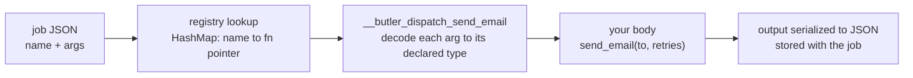
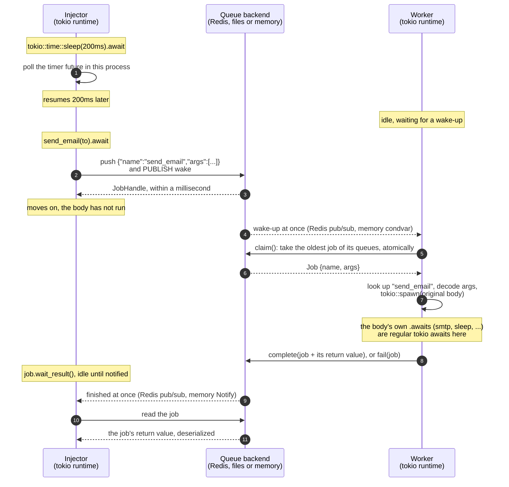
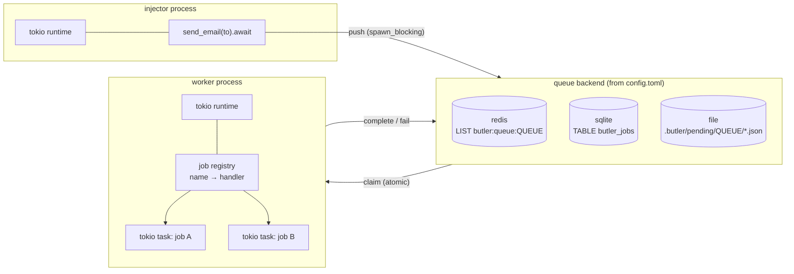
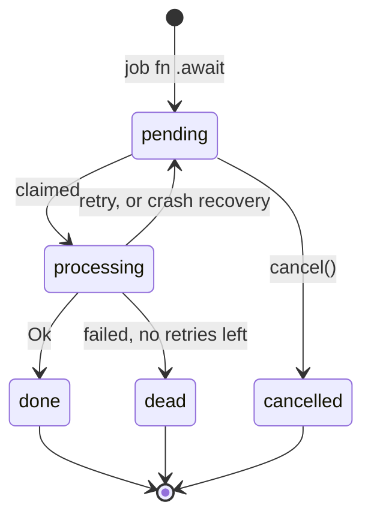

# butler

A small Sidekiq-style background job runner for Rust. Put `#[butler::job]` on an
async function, and calling it with `.await` no longer runs the body. Instead it
queues a job, and a worker process runs the body later.

> [!NOTE]
> **butler is not about speed.** Calling a function directly is always faster
> than sending it through a queue. butler is about **where** work runs and
> **making sure it happens**: spreading jobs over as many workers and servers
> as you need, and not losing them when something restarts or crashes. See
> [Why butler](#why-butler).

## Contents

- [Why butler](#why-butler)
- [Rust at the core](#rust-at-the-core)
- [Performance](#performance)
- [Two kinds of `.await`](#two-kinds-of-await)
  - [How Rust tells them apart](#how-rust-tells-them-apart)
  - [How a worker finds your function](#how-a-worker-finds-your-function)
- [Architecture](#architecture)
  - [Job states are types](#job-states-are-types)
- [Running the demo](#running-the-demo)
- [Usage](#usage)
  - [Defining jobs](#defining-jobs)
  - [Working with an enqueued job](#working-with-an-enqueued-job)
  - [Bulk enqueuing](#bulk-enqueuing)
  - [Results](#results)
  - [Running a worker](#running-a-worker)
  - [Testing](#testing)
  - [Queues and priority](#queues-and-priority)
  - [Concurrency and cores](#concurrency-and-cores)
- [Configuration](#configuration)
- [Cargo features](#cargo-features)
- [Backends](#backends)
  - [Crashed workers don't lose jobs](#crashed-workers-dont-lose-jobs)
  - [File](#file)
  - [Redis](#redis)
  - [SQLite](#sqlite)
  - [Memory](#memory)
- [Limitations](#limitations)
- [Layout](#layout)
- [Development](#development)

## Why butler

Take the classic example: a user signs up, and you send them a welcome email.
Sending it inside the web request makes the user wait on your SMTP provider,
and if the process restarts at the wrong moment, the email is simply never
sent. With butler, the request only records the job, returns at once, and
the job is guaranteed to run somewhere, eventually, even across restarts.

**Spread the load.** Jobs go through a message queue, so the process that
enqueues them and the processes that run them are independent:

- Run workers in separate processes, or on other servers entirely (Redis),
  and add more when the queue grows. Every worker claims jobs atomically, so
  a job is only ever in one worker's hands at a time.
- Keep the web servers free: they only enqueue, which takes about a
  millisecond, and heavy or slow work happens elsewhere.
- Route work with [named queues and priorities](#queues-and-priority), and cap
  what a fragile downstream (an SMTP provider, a rate-limited API) receives
  with [per-queue limits](#concurrency-and-cores).

**Survive restarts and crashes.** A job lives in the queue, not in a process's
memory, until it is done:

- **Enqueued jobs survive restarts.** With Redis, SQLite or files, a job
  enqueued before a deploy is still there after it, and a worker picks it up
  when it comes back. (The in-memory backend is for tests and single-process
  apps: it doesn't survive a restart.)
- **A crash mid-job doesn't lose the job.** A worker holds each job in its own
  processing area and keeps a heartbeat. If it is killed, even with
  `kill -9`, the heartbeat expires and another worker puts the job back in the
  queue and runs it ([how](#crashed-workers-dont-lose-jobs)). The test suite
  checks this with a real worker process aborting mid-job, on the Redis,
  SQLite and file backends.
- **Failures retry, then stay visible.** A job that returns an error or
  panics is retried up to `max_retries` times, and then kept as `dead` with
  its full error chain, instead of disappearing.
- **Shutdowns finish what they started.** On Ctrl-C, a worker stops taking
  new jobs and waits for the running ones to complete.

One consequence to design for: delivery is **at least once**. A job
interrupted by a crash runs again from the start, so a job should be safe to
run twice (for example, record that the welcome email was sent, and skip it
if it already was).

**Write it as plain Rust.** Enqueueing a job looks like calling an async
function, because it is one:

```rust
#[butler::job]
async fn send_welcome(user_id: u64) -> Result<(), MailError> { ... }

send_welcome(user.id).await?;               // enqueued: a worker will send it
```

There is no job struct to declare, no `perform` method to implement, and no
arguments packed into a hash by hand. The compiler checks the arguments at
the call site, `?` handles enqueue errors, and the returned
[`JobHandle`](#working-with-an-enqueued-job) brings the job's result back with
the same `.await` syntax. Moving work out of a request mostly comes down to
adding `#[butler::job]` to the function (its arguments must be serializable)
and running a worker. See [Two kinds of `.await`](#two-kinds-of-await) for
how that works.

**Not built for speed, but fast.** Speed isn't the reason to reach for butler,
but it doesn't cost you any either. Workers run each job as its own tokio
task, so a single worker process can have tens of thousands in flight where
Sidekiq runs a few dozen per process, and CPU-bound jobs spread over every
core. On a 16-CPU machine ([details](#performance)):

- 100,000 jobs that each wait 1 s, all at once in one worker: done in
  **1.88 s** (about 53,000 jobs/s).
- CPU-bound jobs: **12.9× faster** on 16 cores than on one.
- Enqueueing takes about a millisecond on Redis, and **10,000 jobs in 39 ms**
  with [bulk enqueuing](#bulk-enqueuing) (21 ms on SQLite).
- With Redis, SQLite and memory, idle workers wake the moment a job arrives
  (on SQLite, within about 2.5 ms across processes), and `wait_result`
  returns the moment a job finishes, instead of waiting on a polling
  interval. Only the file backend polls.

## Rust at the core

Background jobs cross a process boundary, so most job libraries give up on
types there: arguments become a hash, results a string, states a column. butler
keeps the compiler involved on both sides of the queue.

- **The enqueue call is type-checked.** `#[butler::job]` generates a real
  function with your parameter types, so a wrong argument type or count is a
  compile error, not a runtime surprise in the worker. Parameters take
  `impl JobArg<T>`, so `&str`, `&Path` and `&[T]` work where the job wants
  `String`, `PathBuf` and `Vec<T>`, yet `3` still infers as `u32`
  ([why not `Into<T>`](#defining-jobs)).
- **Results are typed.** A job returning `Result<Sum, MathError>` enqueues as a
  `JobHandle<Sum>`, and `handle.wait_result(..).await?` gives you a `Sum` back,
  deserialized from whatever the worker stored.
- **Job states are types.** `Job<Pending>`, `Job<Processing>`, `Job<Done>`, ...
  are zero-sized-marker typestates behind a sealed trait. Only a claim creates
  a `Job<Processing>`; `complete` and `fail` take it by value, so a job can't be
  finished twice, and only a `Job<Done>` has an `.output()`. Doc tests check
  that the wrong transitions don't compile.
- **Mistakes caught at build time.** An invalid queue name in
  `#[job(queue = "...")]`, a job output that isn't `Serialize`, or two jobs
  with the same name in one worker (at startup) all fail early, with the error
  pointing at your code.
- **Futures you can move around.** The enqueue future is `Send + 'static`
  whatever you pass it: arguments are converted and serialized during the call,
  so it never borrows them. Hand it to `tokio::spawn`, store it, race it.
- **Errors without anyhow.** The library's errors are `thiserror` enums
  (`butler::Error`, `butler::JobError`) you can match on. Jobs return any error
  that converts into `Box<dyn Error + Send + Sync>`: your own enum, `io::Error`,
  a `String`, or `anyhow::Error` if your app uses it. The whole source chain is
  kept in the job's `last_error`.
- **Runtime-agnostic core, tokio when you want it.** Enqueueing and the thread
  worker need no runtime; the `tokio` feature adds `run_async`. Under tokio,
  waiting for a result `await`s a `tokio::sync::Notify` instead of holding a
  thread, so thousands of handles can wait at once.
- **Safe and strict.** `unsafe_code` is denied workspace-wide, and so are
  `unwrap()` and `expect()` outside tests. Clippy runs on every feature
  combination, and every backend passes the same contract test suite.

## Performance

Moving jobs through a queue is the point, not speed (see the note at the top).
These numbers show that once jobs reach a worker, it runs them concurrently
and uses every core, so the worker doesn't become the bottleneck.

`just bench` measures this in one process, with the in-memory backend and
nothing else running. On this 16-CPU machine:

- 2,000 async jobs that each wait 50 ms finished in 117 ms (about 17,000
  jobs/s); one at a time they would take 100 s, so **about 850× faster**.
- **100,000 async jobs that each wait 1 s, all allowed to run at once,
  finished in 1.88 s** (about 53,000 jobs/s, 430 MB peak memory); one at a
  time they would take 28 hours.
- 32 CPU-bound jobs took 2.80 s at concurrency 1 and 217 ms at concurrency 16,
  **12.9× faster**.

Async jobs are tokio tasks, so thousands can wait at once on a few threads.
CPU-bound jobs are plain `fn`s that run on tokio's blocking pool, one core
each. See [Concurrency and cores](#concurrency-and-cores) for tuning.

## Two kinds of `.await`

In the injector's loop, these two lines look the same and mean different
things:

```rust
tokio::time::sleep(Duration::from_millis(200)).await;          // (1) async/await
let id = demo::process_tick(tick, now_ms(), pid).await?;       // (2) enqueue a job
```

1. **Regular async/await.** The future runs right here, in this process, on the
   tokio runtime. The line finishes once the 200ms have passed.
2. **Enqueuing a butler job.** The future serializes the arguments, writes a
   job to the queue and finishes within a millisecond. The function body
   does not run here. A worker process picks up the job and runs it,
   possibly on another machine and possibly much later.

### How Rust tells them apart

It doesn't. For Rust, `.await` always means the same thing: poll this future
until it is ready. `.await` never talks to tokio directly. It only polls the
future in front of it. What happens depends entirely on which function you
called, and that is fixed at compile time.

The `#[butler::job]` macro rewrites the function you wrote. Given

```rust
#[butler::job(queue = "mailers")]
async fn send_email(to: String, retries: u32) -> Result<MessageId, MailError> {
    smtp::send(&to).await
}
```

the compiler sees roughly:

```rust
// 1. What callers get: a function whose only job is to enqueue. Each argument
//    is converted (`&str` -> `String`) and serialized right away, and the
//    future writes the job to the queue. Its output type is computed from the
//    job's return type: `Result<MessageId, _>` gives a `JobHandle<MessageId>`.
pub fn send_email(to: impl JobArg<String>, retries: impl JobArg<u32>)
    -> impl Future<Output = Result<JobHandle<MessageId>, butler::Error>> + Send + 'static
{
    let to: String = to.into_arg();
    let retries: u32 = retries.into_arg();
    let args = butler::__private::args([to_value(&to), to_value(&retries)]);
    async move { butler::__private::enqueue(&send_email::JOB, args?).await }
}

// 2. Your original body, under a hidden name. Only the worker calls it.
async fn __butler_perform_send_email(to: String, retries: u32) -> Result<MessageId, MailError> {
    smtp::send(&to).await
}

// 3. The worker's entry point: JSON in, JSON out. Each argument is decoded
//    into exactly the type you declared; a mismatch is a JobError, not a panic.
fn __butler_dispatch_send_email(args: Vec<Value>) -> BoxFuture {
    Box::pin(async move {
        let mut args = args.into_iter();
        let to: String = butler::__private::arg(&mut args, "send_email", 0)?;
        let retries: u32 = butler::__private::arg(&mut args, "send_email", 1)?;
        butler::__private::output(__butler_perform_send_email(to, retries).await)
    })
}

// 4. The job's descriptor, and its registration: name, queue, entry point.
pub mod send_email {
    pub const JOB: butler::JobDef = butler::JobDef {
        name: "send_email",
        queue: "mailers",
        perform: super::__butler_dispatch_send_email,
    };
}
inventory::submit! { send_email::JOB }
```

So `send_email(...).await` in your app resolves to (1). The worker never calls
`send_email`: it runs (3), which decodes the arguments and runs your original
body (2). A function and a module can share the name `send_email` because Rust
keeps values and types in separate namespaces.

The return type also shows the difference. The enqueue returns
`Result<JobHandle<MessageId>, butler::Error>`, not your function's
`Result<MessageId, MailError>`, so code that expects the job's result won't
compile. You can't accidentally treat a queued job as work that has already
run; the result comes back through the handle (see [Results](#results)).

### How a worker finds your function

The queue holds JSON: `{"name": "send_email", "args": ["ada@example.com", 3], ...}`.
Turning that back into a call takes three steps, all of them set up at compile
time or startup, none per job:



1. **Registration, at link time.** `inventory::submit!` puts each job's `JobDef`
   in a linker section, so every `#[job]` compiled into the binary is found
   without a central list. `Worker::new` collects them into a
   `HashMap<&'static str, fn(Vec<Value>) -> BoxFuture>`, and panics if two jobs
   share a name. Jobs from a library crate can be added explicitly with
   `.register(my_crate::send_email::JOB)`.
2. **Lookup, per job.** One hash lookup by name gives a plain function pointer;
   no reflection, no string matching beyond that lookup. An unknown name (a job from a newer
   release, say) becomes `JobError::UnknownJob`, which retries and then dies
   like any failure instead of crashing the worker.
3. **Decoding, by the job's own code.** The dispatch function was generated
   next to your function, from its signature, so it decodes argument `i` into
   exactly the type of parameter `i` with serde. A payload of the wrong shape is
   `JobError::BadArgument`, naming the job and the argument.

**Why not one generated enum?** A `#[job]` macro only sees the one function it
is attached to, so no macro can see every job in a program, least of all jobs
defined in other crates, to build a single `enum Job { SendEmail(String, u32), ... }`.
It would need a separate macro listing every job by hand, and a new job
anywhere would change that enum. The name-to-function table gets the same
guarantees where they matter: arguments are checked against the real types at
compile time on the enqueue side, and decoded into the real types on the
worker side. It also degrades gracefully across versions: an enqueuer and a
worker built from different releases still agree job by job, where a
serialized enum's variants would have to match exactly.



Inside the worker, the job body is ordinary async code. Its `.await`s are
regular tokio awaits on the worker's runtime, like (1) above: timers, HTTP
clients, database pools all work. If the body calls another `#[butler::job]`
function, that call enqueues a new job, as in Sidekiq and ActiveJob.

## Architecture



Each job moves through these states:



### Job states are types

The same states exist in Rust's type system, so each one only offers what
makes sense for it. A job's type is `Job<S>`, with `S` one of
`butler::state::{Pending, Processing, Done, Dead, Cancelled}`:

```rust
// Only claim creates a Job<Processing>.
let job: Job<Processing> = queue.claim(worker, &["default"], wait)?.unwrap();

// Completing consumes it and returns a Job<Done>, the only state with an output.
let done: Job<Done> = queue.complete(worker, job, output)?;
let value: u32 = done.output()?;

// Failing a (different) claimed job consumes it too: it comes back as a
// Job<Pending> to retry, or a Job<Dead> once it is out of retries.
match queue.fail(worker, other_job, error, max_retries)? {
    Failed::Retry(pending) => println!("retrying after {:?}", pending.last_error()),
    Failed::Dead(dead) => println!("gave up: {}", dead.error()),
}
```

These don't compile (the crate's doc tests check it):

```rust
queue.complete(worker, pending_job, output);  // Job<Pending>: never claimed
queue.complete(worker, job, output);          // twice: the first call took `job`
processing_job.output::<u32>();               // no output until it is Done
```

A job read back from a backend is an `AnyJob`, because its state is only known
when it is read; `match` on it to get the typed `Job`. `handle.job()` returns
one. Cancelling stays a runtime check (`handle.cancel()` returns `false` when
it is too late), because a pending job can be claimed by a worker at any
moment: a `Job<Pending>` value can't promise it is still pending.

## Running the demo

`examples/demo/` has two binaries that share one job (`demo::process_tick`). The
injector enqueues a job every second from a tokio main loop. The worker runs
the jobs in its own tokio main loop, up to 4 at a time. Each job sleeps
1.5s on the tokio timer and returns a `TickReport`, which the injector prints
when it comes back. Every 7th job fails on purpose so you can see a retry,
then a dead job, then the injector receiving the failure.

```sh
# Redis backend (what config.toml selects):
docker run -d --rm --name butler-redis -p 6379:6379 redis:8-alpine

cargo run -p demo --bin worker      # terminal 1
cargo run -p demo --bin injector    # terminal 2

# The same, on the file backend with no Redis:
BUTLER_QUEUE__BACKEND=file cargo run -p demo --bin worker
BUTLER_QUEUE__BACKEND=file cargo run -p demo --bin injector
```

Run both from the repository root, so they read the same `config.toml`. Press
Ctrl-C in the worker to stop it. It stops taking jobs and waits for the ones
already running to finish.

## Usage

### Defining jobs

```rust
#[butler::job]
pub async fn resize_image(path: String, width: u32) -> Result<(), ImageError> { ... }

#[butler::job(name = "billing.charge")]      // stable name, survives renames
pub async fn charge(customer_id: u64, cents: i64) { ... }

#[butler::job(queue = "mailers")]             // like ActiveJob's queue_as :mailers
pub async fn send_digest(user_id: u64) { ... }

#[butler::job]                                // a plain fn: CPU-bound work
pub fn thumbnail(path: PathBuf) -> Result<Vec<u8>, ImageError> { ... }
```

- Parameters must be owned types that serde can serialize and deserialize
  (`String`, not `&str`). They are stored as JSON.
- Callers don't have to pass owned values, though. Each parameter of type `T`
  accepts anything implementing `butler::JobArg<T>`: `T` itself, `&T` for any
  `T: Clone`, plus these conversions:

  | Parameter | Also accepts |
  |---|---|
  | `String` | `&str`, `Cow<str>`, `Box<str>` |
  | `PathBuf` | `&Path`, `&str` |
  | `Vec<T>` | `&[T]` |

  So `send_email("ada@example.com", "Welcome", 3)` works for
  `send_email(to: String, subject: String, retries: u32)`. This is narrower than
  `Into<T>` on purpose: with `impl Into<u32>`, a bare `3` doesn't compile. It
  also means `"text".into()` at a call site is now ambiguous; drop the `.into()`.
- The arguments are converted and serialized when you call the function, so the
  returned future is `Send + 'static` and never borrows them. You can pass it
  to `tokio::spawn`.
- The function may return `()`, or `Result<T, E>` where `T` can be serialized
  and `E` is any error: your own `thiserror` enum, `std::io::Error`, a `String`
  message, or anything else that converts into `butler::BoxError`
  (`Box<dyn Error + Send + Sync>`). butler doesn't depend on anyhow, but an app
  that uses it can return `anyhow::Result<T>` too. The worker stores `T` as the
  job's result. An `Err` or a panic counts as a failure and triggers a retry.
  The error's message and its whole source chain are saved as the job's
  `last_error`, as `outer: inner: root`.
- An `async fn` job runs as its own task on the worker's tokio runtime. A plain
  `fn` job runs on tokio's blocking thread pool, so CPU-heavy or blocking work
  never stalls the async threads. Either way, the body must be `Send`.

### Working with an enqueued job

Awaiting a job function returns a `JobHandle<T>`, where `T` is what the job
returns. Its methods ask the backend for the job's current status, so they
work from any process:

```rust
let job = send_email("ada@example.com", "Welcome").await?;

job.id();                                   // store it; queue.handle(id) rebuilds the handle
job.state().await?;                         // Some(Pending | Processing | Done | Dead | Cancelled)
job.job().await?;                           // the stored record: args, attempts, last_error, result
job.cancel().await?;                        // true if removed before any worker claimed it
job.wait(Duration::from_millis(100)).await?; // poll until Done, Dead or Cancelled
job.result().await?;                        // Some(T) once done, None before
job.wait_result(Duration::from_millis(100)).await?; // T, or the failure
```

### Bulk enqueuing

Like ActiveJob's `perform_all_later`: build the jobs first, then enqueue them
all at once. Every `#[job]` also gets a `prepare` function, with the same
type-checked arguments, that builds the job without enqueueing it:

```rust
let emails = users
    .iter()
    .map(|user| send_email::prepare(&user.email, "Welcome"))  // not enqueued yet
    .collect::<Result<Vec<_>, _>>()?;

let handles: Vec<JobHandle<MessageId>> = butler::enqueue_all(emails).await?;
```

Jobs of different kinds can share a batch, like `perform_all_later` with
several job classes: `.untyped()` erases the output type, and
`handle.with_output::<T>()` brings it back.

```rust
let batch = vec![
    send_email::prepare("ada@example.com", "Welcome")?.untyped(),
    monthly_report::prepare(3)?.untyped(),
];
let handles = butler::enqueue_all(batch).await?;
```

Backends that can do it in one step do, which is where the gain is: 10,000
jobs, one at a time versus one `enqueue_all`:

| Backend | One by one | `enqueue_all` | How |
|---|---|---|---|
| Redis | 734 ms | 39 ms (**19×**) | one pipelined transaction, one wake-up per queue |
| SQLite | 450 ms | 21 ms (**22×**) | one transaction |
| Memory | 3.5 ms | 2.9 ms | one lock |
| File | 1.1 s | 1.2 s | one file per job either way |

Inside `perform_enqueued_jobs`, a batch runs inline, in order.

### Results

Messages go both ways through the same backend. The caller sends the
arguments to a worker; the worker stores the job's return value next to the
job (in the job file, the job's Redis hash, or memory), and the caller reads it
back:

```rust
#[derive(Debug, thiserror::Error)]
enum MathError {
    #[error("{0} + {1} overflows")]
    Overflow(i64, i64),
}

#[butler::job]
async fn add(a: i64, b: i64) -> Result<i64, MathError> {
    a.checked_add(b).ok_or(MathError::Overflow(a, b))
}

let job: JobHandle<i64> = add(2, 3).await?;                  // caller -> worker
let sum = job.wait_result(Duration::from_millis(50)).await?; // worker -> caller
assert_eq!(sum, 5);
```

- **`handle.result()`** returns `Some(value)` once the job is done, and `None`
  while it is pending or running.
- **`handle.wait_result(interval)`** waits for the value. If the job died, it
  returns **`Error::JobFailed`** carrying the job's last error (here,
  `"9223372036854775807 + 1 overflows"` for `add(i64::MAX, 1)`); if it was
  cancelled, **`Error::JobCancelled`**.

With Redis and memory, `wait_result` returns the moment the job finishes: the
backend notifies waiters (Redis over pub/sub, memory in-process), and under
tokio the wait is an `await` on a `tokio::sync::Notify`, so thousands of
handles can wait without holding a thread each. The interval you pass is only
a fallback check; the file backend can't notify, so there it is the polling
interval. The result stays readable as long as the job does (24 hours on
Redis). A handle rebuilt from an id is untyped:
`queue.handle(id).with_output::<i64>()`.

`cancel` is atomic against workers claiming the job: either the worker gets it
or the cancel does, never both. A job that is already running is not
interrupted, and `cancel` returns `false`.

### Running a worker

```rust
#[tokio::main]
async fn main() -> Result<(), Box<dyn std::error::Error>> {
    let config = butler::Config::load()?;
    butler::Worker::from_config(&config)?
        .register(my_jobs::resize_image::JOB)   // see note below
        .run_async(async { let _ = tokio::signal::ctrl_c().await; })
        .await;
    Ok(())
}
```

A worker finds `#[job]` functions compiled into its own crate automatically.
Jobs defined in a separate library crate must be registered with
`.register(lib::job_name::JOB)`. If the worker binary never references
anything from that crate, the linker leaves the crate's code out, including
its automatic registration.

Without tokio, `Worker::run()` runs jobs on plain threads using butler's own
`block_on`. Job bodies then can't use tokio timers or I/O.

In tests, `worker.drain()` runs everything queued, including retries, and
returns, like Sidekiq's `drain_all`.

### Testing

The same helpers as ActiveJob's `TestHelper`, in `butler::testing`. Inside
`perform_enqueued_jobs`, awaiting a job function runs the job right there,
before the `.await` returns: no queue, no worker, no configuration.

```rust
use butler::testing::perform_enqueued_jobs;

#[tokio::test]
async fn it_processes_the_job_immediately() {
    perform_enqueued_jobs(async {
        process_user(user_id).await.unwrap();    // runs now, like perform_later in the block
    })
    .await;

    assert!(user.reload().processed());
}
```

`InlineJobs` does the same and records what ran, for assertions:

```rust
let jobs = InlineJobs::new();
let handle = jobs.perform(async { signup(user_id).await.unwrap() }).await;

assert_eq!(jobs.performed_names(), ["process_user", "signup"]); // jobs that jobs enqueue run too
assert_eq!(handle.result().await?, Some(()));                   // results are there at once
```

| ActiveJob | butler |
|---|---|
| `perform_enqueued_jobs { ... }` | `perform_enqueued_jobs(async { ... }).await` |
| `perform_enqueued_jobs` (no block: run what's queued) | `Worker::new(queue).drain()` |
| `assert_performed_jobs 2 { ... }` | `jobs.perform(...)`, then `jobs.performed().len()` |
| `assert_enqueued_with(job: MyJob)` | enqueue outside the block, then `handle.job().await` |

How it behaves:

- The job's own generated code runs, with the arguments serialized and
  deserialized as a worker would, so a type mismatch shows up in tests too.
- `result()` and `wait_result()` work and return at once. A failing job is
  not retried: it is dead after one attempt, and `wait_result` returns
  `Error::JobFailed` with its error. A panic in a job fails the test, like an
  exception in Rails' block.
- Plain `fn` jobs run inline too (on the blocking pool under tokio).
- It needs no runtime: `butler::block_on(perform_enqueued_jobs(...))` works
  in a plain `#[test]`.
- Inline mode is on while the future you pass is being polled. Work you
  `tokio::spawn` from inside is a separate task, so its jobs are enqueued
  normally.

### Queues and priority

Every job goes on a named queue: `"default"` unless the job says otherwise with
`#[butler::job(queue = "...")]`, as ActiveJob's `queue_as` does. Each worker
chooses which queues it serves and how it prioritizes them, as in Sidekiq:

```toml
[worker]
# Strict: always drain "critical" first, then "default", then "low".
queues = ["critical", "default", "low"]

# Weighted: each claim checks the queues in a random order in which "critical"
# comes first 6 times out of 10, "default" 3, "low" 1. All three keep moving;
# "critical" gets most of the workers.
queues = [["critical", 6], ["default", 3], ["low", 1]]
```

Or in code: `worker.queues(QueuePriority::strict(["critical", "default"]))`, or
`QueuePriority::weighted([("critical", 6), ("default", 3), ("low", 1)])`.

To send one call to another queue than the job's own, like ActiveJob's
`MyJob.set(queue: :low).perform_later`, prepare it and pick the queue:
`report::prepare(3)?.on_queue("low")?.enqueue().await?`.

- **Strict** is simplest, but a busy first queue starves the others.
- **Weighted** never starves a queue; it only changes how often each one is
  checked first. When "critical" is empty, its turns go to the others.
- A worker never runs jobs from queues it doesn't list, and the default is
  just `"default"`. A job on a queue no worker serves waits forever, so the
  worker prints the queues it serves at startup. Dedicated workers are a
  common pattern: one worker for `["critical"]` only, another for the rest.
- Retries and crash recovery put a job back on its own queue.
- Queue names are 1 to 64 of `A-Z a-z 0-9 _ - .` and don't start with a dot. The
  macro checks this at compile time, and the config when it loads.

### Concurrency and cores

`run_async` keeps up to `concurrency` jobs running at once (default: the number
of CPUs), each on the multi-threaded tokio runtime:

- **I/O-bound `async fn` jobs** are tokio tasks, a few hundred bytes each rather
  than a thread. Where Sidekiq runs a few dozen jobs per process (one Ruby
  thread each), a butler worker can run tens of thousands: set `concurrency`
  to 10,000 or 100,000.
- **CPU-bound plain `fn` jobs** run on tokio's blocking pool, one thread each,
  spread across cores. Keep `concurrency` near the CPU count.

```toml
[worker]
concurrency = 100_000     # jobs running at once, across all queues
claimers = 16             # claim loops side by side (default: CPU count)

[worker.queue_limits]     # optional: at most this many at once, per queue
mailers = 20              # e.g. an SMTP provider allowing 20 connections
reports = 2               # heavy jobs that shouldn't pile up
```

- **`concurrency`** caps every queue together. It is a tokio `Semaphore`: each
  running job holds a permit until it finishes.
- **`[worker.queue_limits]`** caps single queues on top of that, like Sidekiq
  Enterprise's per-queue limits. Each limited queue is a lock-free counting
  semaphore. Before claiming, the worker reserves a slot in every queue it is
  about to check and skips the ones already full, so it never takes a job it
  can't start, and **a full queue never holds back the others**: in the test, a
  queue capped at 3 ran exactly 3 at a time while an uncapped one next to it
  ran all 40 of its jobs at once. A job kept waiting only by its queue's limit
  starts within about 10 ms of a slot freeing up. Code:
  `worker.queue_limit("mailers", 20)`.
- **`claimers`** is how many claim loops run side by side. Each takes one job
  at a time from the backend, so more of them start jobs faster; this is what
  lets a very high `concurrency` actually fill up. Raise it for Redis, where
  each claim is a network round trip.

`run()` (plain threads, no tokio) spends one OS thread per job slot, so it caps
itself at 512 threads; use `run_async` for high concurrency.

`just bench` (`cargo run --release -p demo --bin bench`) measures both; see
[Performance](#performance) for the numbers.

Rayon isn't needed for this: tokio already spreads jobs over cores. A single
job that wants to split its own work across cores can still call rayon inside
its body.

## Configuration

`butler::Config::load()` reads `./config.toml`, or the file named by
`$BUTLER_CONFIG`. Every key is optional.

```toml
[queue]
backend = "redis"            # "file" (default), "redis", "sqlite", or "memory"

[queue.file]
dir = ".butler"

[queue.sqlite]
path = "butler.db"           # shared by every process that opens it

[queue.redis]
url = "redis://127.0.0.1:6379/"
prefix = "butler"            # key namespace

[worker]
concurrency = 4              # jobs running at once
max_retries = 3
poll_interval_ms = 100       # file: how often idle workers check; redis, memory: fallback only
heartbeat_ttl_secs = 30      # a crashed worker's jobs are requeued after this
recover_interval_secs = 10   # how often to look for crashed workers
queues = ["default"]         # or ["critical", "default"], or [["critical", 6], ["default", 1]]
claimers = 16                # claim loops side by side (default: the number of CPUs)

[worker.queue_limits]        # optional: jobs running at once, per queue
mailers = 20
```

Environment variables override any key, with `__` between levels:
`BUTLER_QUEUE__BACKEND=file`, `BUTLER_QUEUE__REDIS__URL=redis://host:6379/`,
`BUTLER_WORKER__CONCURRENCY=8`.

## Cargo features

| Feature | Default | Adds |
|---|---|---|
| `tokio` | yes | `Worker::run_async`; inside a tokio runtime, enqueue file and network I/O runs on tokio's blocking thread pool |
| `redis` | yes | `RedisQueue` and `backend = "redis"` |
| `sqlite` | yes | `SqliteQueue` and `backend = "sqlite"`, with SQLite bundled |

To build without Redis, for example to use only the file backend:

```toml
butler = { path = "...", default-features = false, features = ["tokio"] }
```

If `config.toml` selects `redis` in a build without the feature,
`Config::connect()` returns an error saying so.

## Backends

Every backend implements `butler::Backend`. The worker and the enqueue path
only use that trait.

| Backend | A worker notices a new job | `wait_result` notices a finished job | Survives restarts |
|---|---|---|---|
| Redis | instantly: pub/sub | instantly: pub/sub | yes |
| SQLite | same process: instantly; other processes: ~2.5 ms (data-version watch) | same | yes |
| Memory | instantly: condition variable | instantly: in-process notify | no |
| File | every `poll_interval_ms` | every `fallback` interval | yes |

Pick **Redis** to spread workers over several servers, **SQLite** for several
processes on one machine without running a server, **memory** for tests and
single-process apps, and **file** when you want to see every job as a JSON file.

### Crashed workers don't lose jobs

Each worker process has an id. A claim moves the job into that worker's own
processing area, never into its memory alone, and the worker keeps a heartbeat
with an expiry (`heartbeat_ttl_secs`) alive while it runs. A background keeper
refreshes the heartbeat, independently of the jobs, so a long job never makes
its worker look dead.

If a worker is killed or hangs, its heartbeat expires. The next recovery pass
(when any worker starts, and every `recover_interval_secs`) moves that
worker's jobs back to pending, and another worker runs them. This is the same
design as Sidekiq Pro's `super_fetch`.

So delivery is **at least once**: a job interrupted by a crash runs again from
the start. Write job bodies so that running them twice is safe, as with any
Sidekiq or ActiveJob backend. A worker that stalls for longer than its TTL
without crashing can also see its job run a second time elsewhere.

### File

`crates/butler/src/backend/file.rs`. One JSON file per job:

```text
pending/<queue>/  processing/<worker>/  workers/<worker>  done/  dead/  cancelled/
```

Each write goes to `tmp/` first and is then renamed into place, so nothing ever
reads a half-written file. Claiming, cancelling and recovering are all a
`rename`, which is atomic: when several workers race for a job, exactly one
rename succeeds. A heartbeat is the file `workers/<worker>` holding its expiry
time. The file backend can't block waiting for a job, so idle workers sleep
`poll_interval_ms` between checks.

### Redis

`crates/butler/src/backend/redis.rs`. Uses lists, like Sidekiq:

| Key | Type | Purpose |
|---|---|---|
| `butler:queue:<queue>` | LIST | job ids; `LPUSH` to enqueue, taken from the right (FIFO) |
| `butler:processing:<worker>` | LIST | ids that worker claimed |
| `butler:worker:<worker>` | STRING | the worker's heartbeat; expires after `heartbeat_ttl_secs` |
| `butler:workers` | SET | worker ids that may hold jobs, checked by recovery |
| `butler:dead` | LIST | ids that exhausted their retries |
| `butler:wake` | pub/sub channel | a message per push, retry and recovery; wakes idle workers |
| `butler:done` | pub/sub channel | a message per job done, dead or cancelled; wakes `wait_result` |
| `butler:job:<id>` | HASH | `state`, `queue`, and `data` (job JSON); expires 24h after it finishes |

A claim is an `LMOVE queue:<queue> processing:<worker>` for each queue the
worker serves, in its priority order. Redis runs each one atomically, so only
one worker gets each job.

**Idle workers are woken by pub/sub, not polling.** Every push, retry and
recovery also `PUBLISH`es to `butler:wake`. Each worker process keeps one
subscriber connection; a message wakes its idle claims, which re-check their
queues at once, whichever queue the job landed on. In the demo, jobs start 1
to 3 ms after they are enqueued. Pub/sub only carries the signal, never the
job, so reliability still comes from the lists: a missed message (say, during
a reconnect) costs at most `poll_interval_ms`, after which the claim checks
again anyway.

Recovery moves each id back to its own queue with a small Lua script, which
reads the job's queue and moves the id as one atomic step, so two workers
recovering at once can't requeue a job twice. Calls use a small connection
pool, so concurrent claims don't wait on each other.

The job's return value goes into the job hash's `data`, next to its arguments.

It doesn't use Redis `PUBLISH`/`SUBSCRIBE`, for two reasons. Pub/sub sends each
message to every subscriber, so each job would run once per worker. And it
drops messages sent while no worker is connected. A list keeps each job until
exactly one worker takes it.

### SQLite

`crates/butler/src/backend/sqlite.rs`, feature `sqlite` (on by default; SQLite
is compiled in, nothing to install). One database file, shared by any number of
processes on the same machine:

| Table | Columns | Purpose |
|---|---|---|
| `butler_jobs` | `id, queue, state, worker, seq, data` | every job; `data` is the job JSON, `seq` the order in its queue |
| `butler_workers` | `worker, expires_at_ms` | heartbeats, for crash recovery |

A claim is one `UPDATE ... RETURNING` that moves the oldest pending row of a
queue to `processing` under the claiming worker. SQLite runs it under its write
lock, so only one worker gets each job; recovery is a single `UPDATE` too. The
database runs in WAL mode, so readers don't block the writer, with a 5 second
busy timeout for concurrent processes.

**Waking waiters without a server.** SQLite has no pub/sub between processes:
its hooks only see changes made through the same connection. butler combines
two things instead:

- **Same process: instant.** Every write through a `SqliteQueue` notifies its
  waiters directly, like the memory backend.
- **Other processes: about 2.5 ms.** `PRAGMA data_version` changes whenever
  another connection commits. In WAL mode it reads shared memory, not the
  table: 752 ns per check. A watcher thread checks it every 2 ms (about 0.04%
  of one core) and wakes waiters when it moves, so they only re-check the
  queues after a real commit. Measured across two connections: median 2.5 ms,
  worst 2.7 ms. In the two-process demo, jobs started 1 to 4 ms after they
  were enqueued.

The watcher only starts in processes that wait (workers, `wait_result`), not in
ones that only enqueue. Use a file path, not `:memory:`: other processes and the
watcher open their own connections.

### Memory

`crates/butler/src/backend/memory.rs`. Everything lives in the process, behind
one lock: no Redis, no files, nothing to set up. `MemoryQueue::new()` gives an
isolated queue (clones share it), and `backend = "memory"` in `config.toml`
gives one shared queue per process. It follows the same rules as the other
backends, heartbeats and recovery included, and a waiting claim wakes as soon
as a job is pushed. Use it for tests, benchmarks, and apps whose workers run
in the same process. Nothing survives a restart, and finished jobs stay in
memory until the process exits.

`crates/butler/tests/backends.rs` runs the same contract checks (FIFO claims,
waking on push, cancel against claim, results, retries, recovery) against all
four backends.

## Limitations

- **At-least-once delivery.** A job interrupted by a crash runs again (see
  "Crashed workers don't lose jobs"), so job bodies should be safe to repeat.
- **Retries.** Failed jobs are retried right away, with no delay between
  attempts. There are no scheduled jobs (`perform_in`) and no named queues or
  priorities.
- **Polling on the file backend.** Idle file-backed workers check every
  `poll_interval_ms`, and `wait_result` every interval it is given. Redis and
  memory notify both at once.
- **Job names are the contract.** Renaming a function strands jobs already
  queued under the old name. Use `#[job(name = "...")]` for names that need to
  stay stable.

## Layout

```text
Cargo.toml                       workspace: shared metadata, lints, dependency versions
crates/butler/                   the library (published as `butler`)
  src/lib.rs                     public API, global queue, enqueue helper
  src/job.rs                     Job, JobId, JobState
  src/handle.rs                  JobHandle: state, cancel, wait
  src/prepared.rs                PreparedJob, enqueue_all (bulk enqueuing)
  src/testing.rs                 perform_enqueued_jobs, InlineJobs
  src/backend/mod.rs             Backend trait, Queue handle
  src/backend/file.rs            file backend
  src/backend/redis.rs           Redis backend (feature "redis")
  src/backend/sqlite.rs          SQLite backend (feature "sqlite")
  src/backend/memory.rs          in-process backend
  src/config.rs                  config.toml loading
  src/worker.rs                  Worker: run (threads), run_async (tokio), drain
  src/executor.rs                minimal block_on for runtime-free use
  tests/                         end-to-end tests (file, tokio, redis, retries,
                                 crash recovery with a real aborted worker)
  examples/no_tokio.rs           the same flow without tokio
crates/butler-macros/            #[job] attribute macro (published as `butler-macros`)
examples/demo/                   injector + worker binaries, and bench (not published)
justfile                 format, lint, test, audit and demo tasks
deny.toml, taplo.toml    dependency policy, TOML formatting
```

## Development

The toolchain is pinned in `rust-toolchain.toml` (and `mise.toml`). Common
tasks are in the `justfile`:

```sh
just format        # cargo fmt + taplo fmt
just ci            # format check, clippy on every feature combination, tests
just audit-deps    # cargo deny: advisories, bans, sources
just redis         # throwaway Redis for the demo and the Redis test
just worker        # demo worker
just injector      # demo injector
just bench         # multi-core benchmark, in memory
just publish-dry-run  # package and verify both crates as crates.io would
```

Workspace lints deny `unsafe_code`, `unused_qualifications`, `unwrap_used` and
`expect_used`; tests opt out with a file-level `#![allow(...)]`. The Redis test
needs a server at `$BUTLER_TEST_REDIS_URL` or `redis://127.0.0.1:6379/`, and is
skipped when none is reachable. Code conventions are in `AGENTS.md`.
