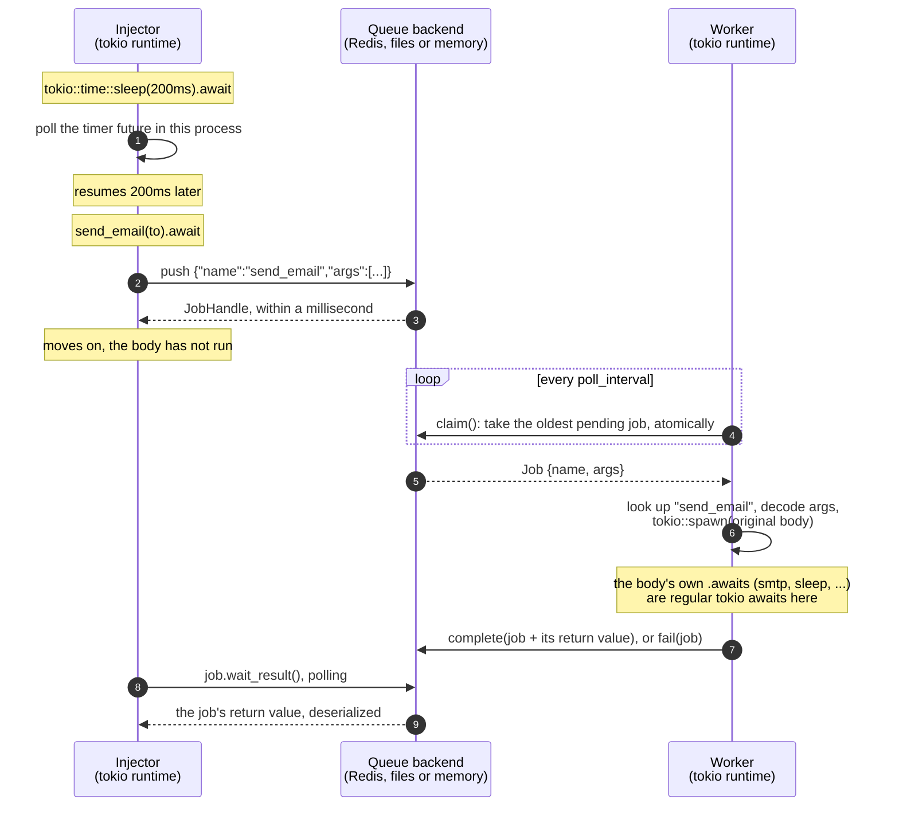
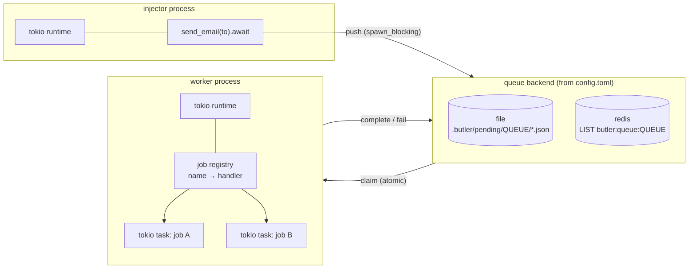
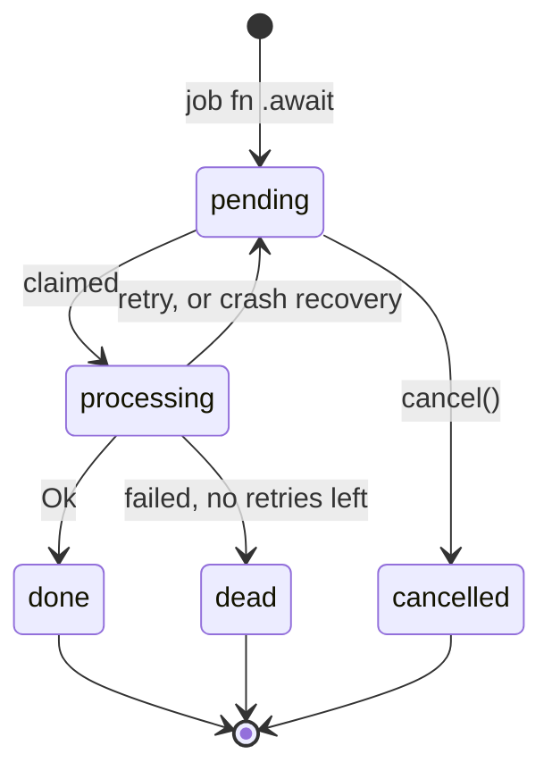

# butler

A small Sidekiq-style background job runner for Rust. Put `#[butler::job]` on an
async function, and calling it with `.await` no longer runs the body. Instead it
queues a job, and a worker process runs the body later.

## Contents

- [Performance](#performance)
- [Two kinds of `.await`](#two-kinds-of-await)
  - [How Rust tells them apart](#how-rust-tells-them-apart)
- [Architecture](#architecture)
- [Running the demo](#running-the-demo)
- [Usage](#usage)
  - [Defining jobs](#defining-jobs)
  - [Working with an enqueued job](#working-with-an-enqueued-job)
  - [Results](#results)
  - [Running a worker](#running-a-worker)
  - [Queues and priority](#queues-and-priority)
  - [Concurrency and cores](#concurrency-and-cores)
- [Configuration](#configuration)
- [Cargo features](#cargo-features)
- [Backends](#backends)
  - [Crashed workers don't lose jobs](#crashed-workers-dont-lose-jobs)
  - [File](#file)
  - [Redis](#redis)
  - [Memory](#memory)
- [Limitations](#limitations)
- [Layout](#layout)
- [Development](#development)

```rust
#[butler::job]
async fn send_email(to: String, subject: String) -> Result<MessageId, MailError> {
    smtp::send(&to, &subject).await   // runs later, in the worker
}

// In your app: this puts the job on the queue and returns right away.
let job = send_email("ada@example.com", "Welcome").await?;

// Later, or from another process: the worker's return value comes back.
let message_id: MessageId = job.wait_result(Duration::from_millis(100)).await?;
```

This is an MVP: the queue is Redis, a directory of JSON files, or in memory,
and the worker runs on tokio or on plain threads.

> [!TIP]
> **Jobs return values, and you get them back.** `handle.result()` returns the
> value once the job is done. `handle.wait_result(interval)` waits for it, and
> returns `Error::JobFailed` (carrying the job's last error) if the job died, or
> `Error::JobCancelled` if it was cancelled. The value travels back through the
> same Redis, files or memory as the arguments. See [Results](#results).

## Performance

`just bench` measures this in one process, with the in-memory backend and
nothing else running. On this 16-CPU machine:

- 2,000 async jobs that each wait 50 ms finished in 134 ms (about 15,000
  jobs/s); one at a time they would take 100 s.
- 32 CPU-bound jobs took 2.77 s at concurrency 1 and 255 ms at concurrency 16,
  **10.9× faster**.

Async jobs are tokio tasks, so thousands can wait at once on a few threads.
CPU-bound jobs are plain `fn`s that run on tokio's blocking pool, one core
each. See [Concurrency and cores](#concurrency-and-cores) for tuning.

## Two kinds of `.await`

In the injector's loop, these two lines look the same and mean different
things:

```rust
tokio::time::sleep(Duration::from_millis(200)).await;          // (1) async/await
let id = demo::process_tick(tick, now_ms(), pid).await?;       // (2) enqueue a job
```

1. **Regular async/await.** The future runs right here, in this process, on the
   tokio runtime. The line finishes once the 200ms have passed.
2. **Enqueuing a butler job.** The future serializes the arguments, writes a
   job to the queue and finishes within a millisecond. The function body
   does not run here. A worker process picks up the job and runs it,
   possibly on another machine and possibly much later.

### How Rust tells them apart

It doesn't. For Rust, `.await` always means the same thing: poll this future
until it is ready. `.await` never talks to tokio directly. It only polls the
future in front of it. What happens depends entirely on which function you
called, and that is fixed at compile time.

The `#[butler::job]` macro rewrites the function you wrote. Given

```rust
#[butler::job]
async fn send_email(to: String) -> Result<(), MailError> { smtp::send(&to).await }
```

the compiler sees roughly:

```rust
// 1. What callers get: a function whose only job is to enqueue. It accepts
//    `&str` for a `String` parameter (see "Arguments" below), converts and
//    serializes right away, and returns a future that writes to the queue.
fn send_email(to: impl JobArg<String>)
    -> impl Future<Output = Result<JobHandle<()>, butler::Error>> + Send + 'static
{
    let to: String = to.into_arg();
    let args = butler::__private::args([serde_json::to_value(&to)]);
    async move { butler::__private::enqueue("send_email", args?).await }
}

// 2. Your original body, under a hidden name. Only the worker calls it.
async fn __butler_perform_send_email(to: String) -> Result<(), MailError> {
    smtp::send(&to).await
}

// 3. A function that decodes the JSON args and calls (2).
fn __butler_dispatch_send_email(args: Vec<Value>) -> BoxFuture { /* ... */ }

// 4. A registration entry: "send_email" -> (3), so a worker can find it by name.
mod send_email { pub const JOB: butler::JobDef = /* ... */; }
inventory::submit! { send_email::JOB }
```

So `send_email(...).await` in your app resolves to (1). The worker never calls
`send_email`. It reads `"name": "send_email"` from the queued job, looks up that
name, and runs (3), which runs your original body (2).

The return type also shows the difference. The enqueue returns
`Result<JobHandle<()>, butler::Error>`, not your function's `Result<(), MailError>`,
so code that expects the job's result won't compile. You can't accidentally
treat a queued job as work that has already run. The handle is typed by what
the job returns, so its result can come back later (see "Results").



Inside the worker, the job body is ordinary async code. Its `.await`s are
regular tokio awaits on the worker's runtime, like (1) above: timers, HTTP
clients, database pools all work. If the body calls another `#[butler::job]`
function, that call enqueues a new job, as in Sidekiq and ActiveJob.

## Architecture



Each job moves through these states:



## Running the demo

`examples/demo/` has two binaries that share one job (`demo::process_tick`). The
injector enqueues a job every second from a tokio main loop. The worker runs
the jobs in its own tokio main loop, up to 4 at a time. Each job sleeps
1.5s on the tokio timer and returns a `TickReport`, which the injector prints
when it comes back. Every 7th job fails on purpose so you can see a retry,
then a dead job, then the injector receiving the failure.

```sh
# Redis backend (what config.toml selects):
docker run -d --rm --name butler-redis -p 6379:6379 redis:8-alpine

cargo run -p demo --bin worker      # terminal 1
cargo run -p demo --bin injector    # terminal 2

# The same, on the file backend with no Redis:
BUTLER_QUEUE__BACKEND=file cargo run -p demo --bin worker
BUTLER_QUEUE__BACKEND=file cargo run -p demo --bin injector
```

Run both from the repository root, so they read the same `config.toml`. Press
Ctrl-C in the worker to stop it. It stops taking jobs and waits for the ones
already running to finish.

## Usage

### Defining jobs

```rust
#[butler::job]
pub async fn resize_image(path: String, width: u32) -> Result<(), ImageError> { ... }

#[butler::job(name = "billing.charge")]      // stable name, survives renames
pub async fn charge(customer_id: u64, cents: i64) { ... }

#[butler::job(queue = "mailers")]             // like ActiveJob's queue_as :mailers
pub async fn send_digest(user_id: u64) { ... }

#[butler::job]                                // a plain fn: CPU-bound work
pub fn thumbnail(path: PathBuf) -> Result<Vec<u8>, ImageError> { ... }
```

- Parameters must be owned types that serde can serialize and deserialize
  (`String`, not `&str`). They are stored as JSON.
- Callers don't have to pass owned values, though. Each parameter of type `T`
  accepts anything implementing `butler::JobArg<T>`: `T` itself, `&T` for any
  `T: Clone`, plus these conversions:

  | Parameter | Also accepts |
  |---|---|
  | `String` | `&str`, `Cow<str>`, `Box<str>` |
  | `PathBuf` | `&Path`, `&str` |
  | `Vec<T>` | `&[T]` |

  So `send_email("ada@example.com", "Welcome", 3)` works for
  `send_email(to: String, subject: String, retries: u32)`. This is narrower than
  `Into<T>` on purpose: with `impl Into<u32>`, a bare `3` doesn't compile. It
  also means `"text".into()` at a call site is now ambiguous; drop the `.into()`.
- The arguments are converted and serialized when you call the function, so the
  returned future is `Send + 'static` and never borrows them. You can pass it
  to `tokio::spawn`.
- The function may return `()`, or `Result<T, E>` where `T` can be serialized
  and `E` is any error: your own `thiserror` enum, `std::io::Error`, a `String`
  message, or anything else that converts into `butler::BoxError`
  (`Box<dyn Error + Send + Sync>`). butler doesn't depend on anyhow, but an app
  that uses it can return `anyhow::Result<T>` too. The worker stores `T` as the
  job's result. An `Err` or a panic counts as a failure and triggers a retry.
  The error's message and its whole source chain are saved as the job's
  `last_error`, as `outer: inner: root`.
- An `async fn` job runs as its own task on the worker's tokio runtime. A plain
  `fn` job runs on tokio's blocking thread pool, so CPU-heavy or blocking work
  never stalls the async threads. Either way, the body must be `Send`.

### Working with an enqueued job

Awaiting a job function returns a `JobHandle<T>`, where `T` is what the job
returns. Its methods ask the backend for the job's current status, so they
work from any process:

```rust
let job = send_email("ada@example.com", "Welcome").await?;

job.id();                                   // store it; queue.handle(id) rebuilds the handle
job.state().await?;                         // Some(Pending | Processing | Done | Dead | Cancelled)
job.job().await?;                           // the stored record: args, attempts, last_error, result
job.cancel().await?;                        // true if removed before any worker claimed it
job.wait(Duration::from_millis(100)).await?; // poll until Done, Dead or Cancelled
job.result().await?;                        // Some(T) once done, None before
job.wait_result(Duration::from_millis(100)).await?; // T, or the failure
```

### Results

Messages go both ways through the same backend. The caller sends the
arguments to a worker; the worker stores the job's return value next to the
job (in the job file, the job's Redis hash, or memory), and the caller reads it
back:

```rust
#[derive(Debug, thiserror::Error)]
enum MathError {
    #[error("{0} + {1} overflows")]
    Overflow(i64, i64),
}

#[butler::job]
async fn add(a: i64, b: i64) -> Result<i64, MathError> {
    a.checked_add(b).ok_or(MathError::Overflow(a, b))
}

let job: JobHandle<i64> = add(2, 3).await?;                  // caller -> worker
let sum = job.wait_result(Duration::from_millis(50)).await?; // worker -> caller
assert_eq!(sum, 5);
```

- **`handle.result()`** returns `Some(value)` once the job is done, and `None`
  while it is pending or running.
- **`handle.wait_result(interval)`** waits for the value. If the job died, it
  returns **`Error::JobFailed`** carrying the job's last error (here,
  `"9223372036854775807 + 1 overflows"` for `add(i64::MAX, 1)`); if it was
  cancelled, **`Error::JobCancelled`**.

It polls at the interval you pass; the result stays readable as long as the
job does (24 hours on Redis). A handle rebuilt from an id is untyped:
`queue.handle(id).with_output::<i64>()`.

`cancel` is atomic against workers claiming the job: either the worker gets it
or the cancel does, never both. A job that is already running is not
interrupted, and `cancel` returns `false`.

### Running a worker

```rust
#[tokio::main]
async fn main() -> Result<(), Box<dyn std::error::Error>> {
    let config = butler::Config::load()?;
    butler::Worker::from_config(&config)?
        .register(my_jobs::resize_image::JOB)   // see note below
        .run_async(async { let _ = tokio::signal::ctrl_c().await; })
        .await;
    Ok(())
}
```

A worker finds `#[job]` functions compiled into its own crate automatically.
Jobs defined in a separate library crate must be registered with
`.register(lib::job_name::JOB)`. If the worker binary never references
anything from that crate, the linker leaves the crate's code out, including
its automatic registration.

Without tokio, `Worker::run()` runs jobs on plain threads using butler's own
`block_on`. Job bodies then can't use tokio timers or I/O.

In tests, `worker.drain()` runs everything queued, including retries, and
returns, like Sidekiq's `drain_all`.

### Queues and priority

Every job goes on a named queue: `"default"` unless the job says otherwise with
`#[butler::job(queue = "...")]`, as ActiveJob's `queue_as` does. Each worker
chooses which queues it serves and how it prioritizes them, as in Sidekiq:

```toml
[worker]
# Strict: always drain "critical" first, then "default", then "low".
queues = ["critical", "default", "low"]

# Weighted: each claim checks the queues in a random order in which "critical"
# comes first 6 times out of 10, "default" 3, "low" 1. All three keep moving;
# "critical" gets most of the workers.
queues = [["critical", 6], ["default", 3], ["low", 1]]
```

Or in code: `worker.queues(QueuePriority::strict(["critical", "default"]))`, or
`QueuePriority::weighted([("critical", 6), ("default", 3), ("low", 1)])`.

- **Strict** is simplest, but a busy first queue starves the others.
- **Weighted** never starves a queue; it only changes how often each one is
  checked first. When "critical" is empty, its turns go to the others.
- A worker never runs jobs from queues it doesn't list, and the default is
  just `"default"`. A job on a queue no worker serves waits forever, so the
  worker prints the queues it serves at startup. Dedicated workers are a
  common pattern: one worker for `["critical"]` only, another for the rest.
- Retries and crash recovery put a job back on its own queue.
- Queue names are 1 to 64 of `A-Z a-z 0-9 _ - .` and don't start with a dot. The
  macro checks this at compile time, and the config when it loads.

### Concurrency and cores

`run_async` keeps up to `concurrency` jobs running at once (default: the number
of CPUs), each on the multi-threaded tokio runtime:

- **I/O-bound `async fn` jobs** are tokio tasks. Thousands can wait at once on
  a few threads, so raise `concurrency` well past the CPU count.
- **CPU-bound plain `fn` jobs** run on tokio's blocking pool, one thread each,
  spread across cores. Keep `concurrency` near the CPU count.

`just bench` (`cargo run --release -p demo --bin bench`) measures both; see
[Performance](#performance) for the numbers.

Rayon isn't needed for this: tokio already spreads jobs over cores. A single
job that wants to split its own work across cores can still call rayon inside
its body.

## Configuration

`butler::Config::load()` reads `./config.toml`, or the file named by
`$BUTLER_CONFIG`. Every key is optional.

```toml
[queue]
backend = "redis"            # "file" (default), "redis", or "memory"

[queue.file]
dir = ".butler"

[queue.redis]
url = "redis://127.0.0.1:6379/"
prefix = "butler"            # key namespace

[worker]
concurrency = 4              # jobs running at once
max_retries = 3
poll_interval_ms = 100       # longest wait for a job before checking again
heartbeat_ttl_secs = 30      # a crashed worker's jobs are requeued after this
recover_interval_secs = 10   # how often to look for crashed workers
queues = ["default"]         # or ["critical", "default"], or [["critical", 6], ["default", 1]]
```

Environment variables override any key, with `__` between levels:
`BUTLER_QUEUE__BACKEND=file`, `BUTLER_QUEUE__REDIS__URL=redis://host:6379/`,
`BUTLER_WORKER__CONCURRENCY=8`.

## Cargo features

| Feature | Default | Adds |
|---|---|---|
| `tokio` | yes | `Worker::run_async`; inside a tokio runtime, enqueue file and network I/O runs on tokio's blocking thread pool |
| `redis` | yes | `RedisQueue` and `backend = "redis"` |

To build without Redis, for example to use only the file backend:

```toml
butler = { path = "...", default-features = false, features = ["tokio"] }
```

If `config.toml` selects `redis` in a build without the feature,
`Config::connect()` returns an error saying so.

## Backends

Both backends implement `butler::Backend`. The worker and the enqueue path
only use that trait.

### Crashed workers don't lose jobs

Each worker process has an id. A claim moves the job into that worker's own
processing area, never into its memory alone, and the worker keeps a heartbeat
with an expiry (`heartbeat_ttl_secs`) alive while it runs. A background keeper
refreshes the heartbeat, independently of the jobs, so a long job never makes
its worker look dead.

If a worker is killed or hangs, its heartbeat expires. The next recovery pass
(when any worker starts, and every `recover_interval_secs`) moves that
worker's jobs back to pending, and another worker runs them. This is the same
design as Sidekiq Pro's `super_fetch`.

So delivery is **at least once**: a job interrupted by a crash runs again from
the start. Write job bodies so that running them twice is safe, as with any
Sidekiq or ActiveJob backend. A worker that stalls for longer than its TTL
without crashing can also see its job run a second time elsewhere.

### File

`crates/butler/src/backend/file.rs`. One JSON file per job:

```text
pending/<queue>/  processing/<worker>/  workers/<worker>  done/  dead/  cancelled/
```

Each write goes to `tmp/` first and is then renamed into place, so nothing ever
reads a half-written file. Claiming, cancelling and recovering are all a
`rename`, which is atomic: when several workers race for a job, exactly one
rename succeeds. A heartbeat is the file `workers/<worker>` holding its expiry
time. The file backend can't block waiting for a job, so idle workers sleep
`poll_interval_ms` between checks.

### Redis

`crates/butler/src/backend/redis.rs`. Uses lists, like Sidekiq:

| Key | Type | Purpose |
|---|---|---|
| `butler:queue:<queue>` | LIST | job ids; `LPUSH` to enqueue, taken from the right (FIFO) |
| `butler:processing:<worker>` | LIST | ids that worker claimed |
| `butler:worker:<worker>` | STRING | the worker's heartbeat; expires after `heartbeat_ttl_secs` |
| `butler:workers` | SET | worker ids that may hold jobs, checked by recovery |
| `butler:dead` | LIST | ids that exhausted their retries |
| `butler:job:<id>` | HASH | `state`, `queue`, and `data` (job JSON); expires 24h after it finishes |

A claim is an `LMOVE queue:<queue> processing:<worker>` for each queue the
worker serves, in its priority order. Redis runs each one atomically, so only
one worker gets each job. When every queue is empty, the claim blocks with
`BLMOVE` on the first queue in that order for up to `poll_interval_ms`: jobs on
it start at once, and jobs on the others within `poll_interval_ms`. Recovery
moves each id back to its own queue with a small Lua script, which reads the
job's queue and moves the id as one atomic step, so two workers recovering at
once can't requeue a job twice. Calls use a small connection
pool, so a worker blocked in `BLMOVE` doesn't hold up the others.

The job's return value goes into the job hash's `data`, next to its arguments.

It doesn't use Redis `PUBLISH`/`SUBSCRIBE`, for two reasons. Pub/sub sends each
message to every subscriber, so each job would run once per worker. And it
drops messages sent while no worker is connected. A list keeps each job until
exactly one worker takes it.

### Memory

`crates/butler/src/backend/memory.rs`. Everything lives in the process, behind
one lock: no Redis, no files, nothing to set up. `MemoryQueue::new()` gives an
isolated queue (clones share it), and `backend = "memory"` in `config.toml`
gives one shared queue per process. It follows the same rules as the other
backends, heartbeats and recovery included, and a waiting claim wakes as soon
as a job is pushed. Use it for tests, benchmarks, and apps whose workers run
in the same process. Nothing survives a restart, and finished jobs stay in
memory until the process exits.

`crates/butler/tests/backends.rs` runs the same contract checks (FIFO claims,
waking on push, cancel against claim, results, retries, recovery) against all
three backends.

## Limitations

- **At-least-once delivery.** A job interrupted by a crash runs again (see
  "Crashed workers don't lose jobs"), so job bodies should be safe to repeat.
- **Retries.** Failed jobs are retried right away, with no delay between
  attempts. There are no scheduled jobs (`perform_in`) and no named queues or
  priorities.
- **Results are polled.** `wait_result` checks the job every interval you
  give it; nothing pushes the result to the caller.
- **Polling on the file backend.** Idle file-backed workers check every
  `poll_interval_ms`; Redis workers wake as soon as a job arrives.
- **Job names are the contract.** Renaming a function strands jobs already
  queued under the old name. Use `#[job(name = "...")]` for names that need to
  stay stable.

## Layout

```text
Cargo.toml                       workspace: shared metadata, lints, dependency versions
crates/butler/                   the library (published as `butler`)
  src/lib.rs                     public API, global queue, enqueue helper
  src/job.rs                     Job, JobId, JobState
  src/handle.rs                  JobHandle: state, cancel, wait
  src/backend/mod.rs             Backend trait, Queue handle
  src/backend/file.rs            file backend
  src/backend/redis.rs           Redis backend (feature "redis")
  src/backend/memory.rs          in-process backend
  src/config.rs                  config.toml loading
  src/worker.rs                  Worker: run (threads), run_async (tokio), drain
  src/executor.rs                minimal block_on for runtime-free use
  tests/                         end-to-end tests (file, tokio, redis, retries,
                                 crash recovery with a real aborted worker)
  examples/no_tokio.rs           the same flow without tokio
crates/butler-macros/            #[job] attribute macro (published as `butler-macros`)
examples/demo/                   injector + worker binaries, and bench (not published)
justfile                 format, lint, test, audit and demo tasks
deny.toml, taplo.toml    dependency policy, TOML formatting
```

## Development

The toolchain is pinned in `rust-toolchain.toml` (and `mise.toml`). Common
tasks are in the `justfile`:

```sh
just format        # cargo fmt + taplo fmt
just ci            # format check, clippy on every feature combination, tests
just audit-deps    # cargo deny: advisories, bans, sources
just redis         # throwaway Redis for the demo and the Redis test
just worker        # demo worker
just injector      # demo injector
just bench         # multi-core benchmark, in memory
just publish-dry-run  # package and verify both crates as crates.io would
```

Workspace lints deny `unsafe_code`, `unused_qualifications`, `unwrap_used` and
`expect_used`; tests opt out with a file-level `#![allow(...)]`. The Redis test
needs a server at `$BUTLER_TEST_REDIS_URL` or `redis://127.0.0.1:6379/`, and is
skipped when none is reachable. Code conventions are in `AGENTS.md`.
